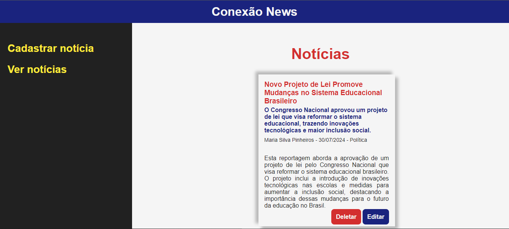

<h1 align="center" style="font-weight: bold;">Conexão News 📰</h1>

<p align="center">
 <a href="#tech">Tecnologias</a> • 
 <a href="#started">Getting Started</a>
</p>

<p align="center">
    <b>Projeto feito para a disciplina de Laboratório de programação 3 com o intuito de colocar em prática tudo o que foi aprendido no 1° trimestre com a linguagem PHP.</b>
</p>

<h2 id="layout">🎨 Layout</h2>

<p align="center">
    
</p>

<h2 id="tech">💻 Tecnologias</h2>

- PHP
- Mysql
- HTML
- CSS

<h2 id="started">🚀 Getting started</h2>

Como rodar seu projeto localmente

<h3>Pre-requisitos</h3>

- [PHP](https://www.php.net/)
- [Xampp](https://www.apachefriends.org/pt_br/index.html)
- [Git 2](https://git-scm.com/)

<h3>Clonando</h3>

Como clonar o projeto

```bash
cd C://xampp/htdocs
git clone https://github.com/MateusGomesc/conexao-news.git
```
